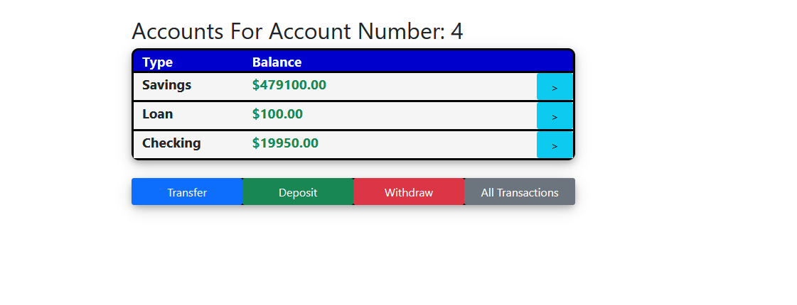
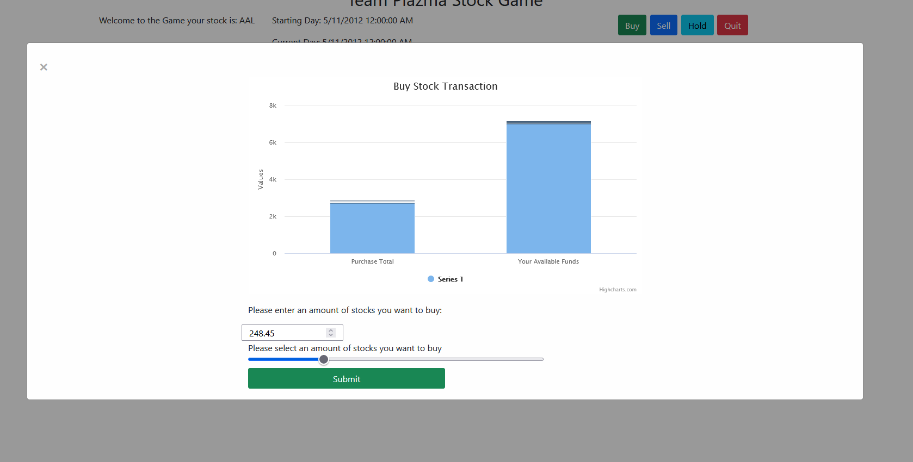
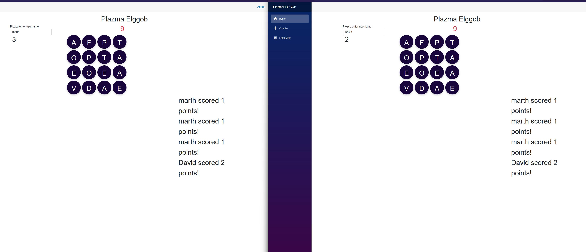
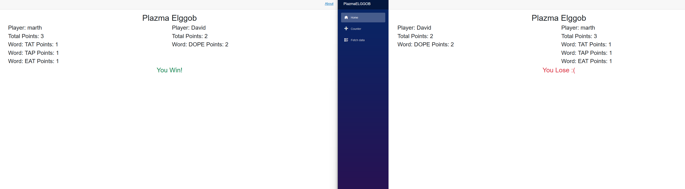

# Adam Aguirre's Project Portfolio

## Hangman

Simple website that uses a Database and php to play hangman.

https://github.com/AdamAguir/PHPHangman

````
    $index = $_SESSION["wordIndex"];
    $sql = "SELECT WORD_VALUE FROM Word WHERE ID = '$index'";
    $result = $conn->query($sql);
    if ($result->num_rows > 0) {
        // output data of each row
        while ($row = $result->fetch_assoc()) {
            $word = $row["WORD_VALUE"];
        }
    }
````

This code uses php to fetch data from a database. From there it compares the word to what is in
the player has previously guessed. The guessed letters are stored in the session. The next code
snippet does the actual compare.

````
for ($index = 0; $index < $length; $index++) {
            if(strlen($_SESSION["letters"]) > 0){
                foreach ($lettersGuessed as $char) {
                    if (strpos($wordArray, $char, $offset = 0)) {
                        if ($word[$index] == $char) {
                            $displayWord[$index] = $char;
                        }
                    } else if(!strpos($wrongGuesses, $char, $offset = 0)){
                          $wrongGuesses .= $char;
                    }
                }
            }
        }
````

## Bank App

A Bank application created in asp.net core. It uses Entity Framework to connect the Database

https://github.com/Alex-Bedoya/CS3750BankApp

````
 foreach (Account account in Model.Accounts)
        {
            <div class="row accountDisplay fw-bold">
                <div class="col-3">
                    <label>@account.Type</label>
                </div>
                <div class="col-8">
                @{
                    double amount = account.Balance / 100.0;
                    string strAmount = amount.ToString("0.00");
                }
                    <label class="@(account.Balance > 0 ? "text-success" : "text-danger")">$@strAmount</label>
                </div>
                <a class="mx-auto float-end col-1 btn btn-info" asp-page="AccountDetails" asp-route-Type="@account.Type" asp-route-AccNum="@account.AccountNumber">></a>
            </div>
        }
````

This code creates an html element for each account associated with the user. It is the primary display for the uer's bank account, and also includes a way to view a detailed account view.



## Stock Market Game

The Stock Market game uses ajax methods to refresh the display based on user inputs.

https://github.com/Alex-Bedoya/PlazmaStockGame

````
  function DrawBuyChart() {
            var purchase = 0;
            var adjustAmount = moneyRemaining;
            buyChart = new Highcharts.Chart({
                chart: {
                    renderTo: 'buyChart',
                    animation: false
                },
                title: {
                    text: 'Buy Stock Transaction'
                },
                xAxis: {
                    categories: ['Purchase Total', 'Your Available Funds']
                },
                plotOptions: {
                    series: {
                        point: {
                            events: {
                                drag: function(e) {
                                    // Returning false stops the drag and drops. Example:
                                    //if (this.series.yData[0] >= @Model.CurrMoney) {
                                    //    this.y = @Model.CurrMoney;
                                    //    this.series.yData[0] = @Model.CurrMoney;
                                    //    return false;
                                    //}
                                    if (this.category == "Purchase Total") {
                                        purchase = this.series.yData[0];
                                        adjustAmount = moneyRemaining - purchase;
                                    }
                                    if (this.category == "Your Available Funds") {
                                        purchase = moneyRemaining - this.series.yData[1];
                                        adjustAmount = this.series.yData[1];
                                    }
                                    //$('#drag').html(
                                    //    'Dragging <b>' + this.series.name + '</b>, <b>' + this.category + '</b> to <b>' + purchase.toFixed(2) + '</b> adjusted: <b>' + adjustAmount.toFixed(2) + '</b>');
                                },
                                drop: function() {
                                    this.series.setData([purchase, adjustAmount]);
                                    var stockDifferance = purchase / stockPrice;
                                    document.getElementById('txtBuyQuantity').value = stockDifferance.toFixed(2);
                                    //var percent = (purchase / moneyRemaining) * 100;
                                    document.getElementById('buyRange').value = stockDifferance;
                                }
                            }
                        },
                        stickyTracking: false
                    },
                    column: {
                        stacking: 'normal'
                    },
                    line: {
                        cursor: 'ns-resize'
                    }
                },
                tooltip: {
                    yDecimals: 2
                },
                series: [{
                    data: [purchase, adjustAmount - purchase],
                    draggableY: true,
                    dragMinY: 0,
                    type: 'column',
                    minPointLength: 2
                }]
            });
        };

````

This code uses a resource called Highcharts. It is something you can import into your aplication. This section creates the values
seen in the graph. The player can also interact with the graph and use it as a form of input. This action also changes the values
in the text box and the slider to the same values.



## Boggle Game

A Blazor application that utalizes an api for words and SignalR for communication between players.

https://github.com/AdamAguir/PlazmaELGGOB



````
public Task SendMessage(string user, string points)
        {
            return Clients.All.SendAsync("RecieveMessage", user, points);
        }
````

This is the code that goes in the hub class that transmits the message to the other users.

````
  protected override async Task OnInitializedAsync()
    {

        hubConnection = new HubConnectionBuilder()
        .WithUrl(navManager.ToAbsoluteUri("/pointhub"))
        .WithAutomaticReconnect()
        .Build();

        // this is where we capture data coming back.
        hubConnection.On<string, string>("RecieveMessage", (user, points) =>
        {
            var formattedMessage = $"{user} scored {points} points!";
            messeges.Add(formattedMessage);
            InvokeAsync(StateHasChanged);
        });

        // this is the timer hub
        hubConnection.On<int>("UpdateTimer", (timeRemaning) =>
        {

        });

        hubConnection.On<GameHistory>("RecieveHistory", (sendHistory) =>
        {
            opponetHistory = sendHistory;
            InvokeAsync(StateHasChanged);
        });

        // start timer

        hubConnection.On("StartTimer", () =>
        {
            if (aTimer == null)
            {
                StartTimer();
            }
        });


        await hubConnection.StartAsync();
    }

````
Using this block you can capture incomming data from the hub and then utilize it in the way needed.
In our case to capture the messeges sent between players and eventually the game comparing to the
players opponet.



